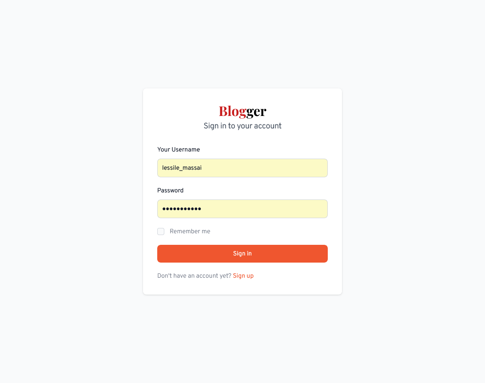
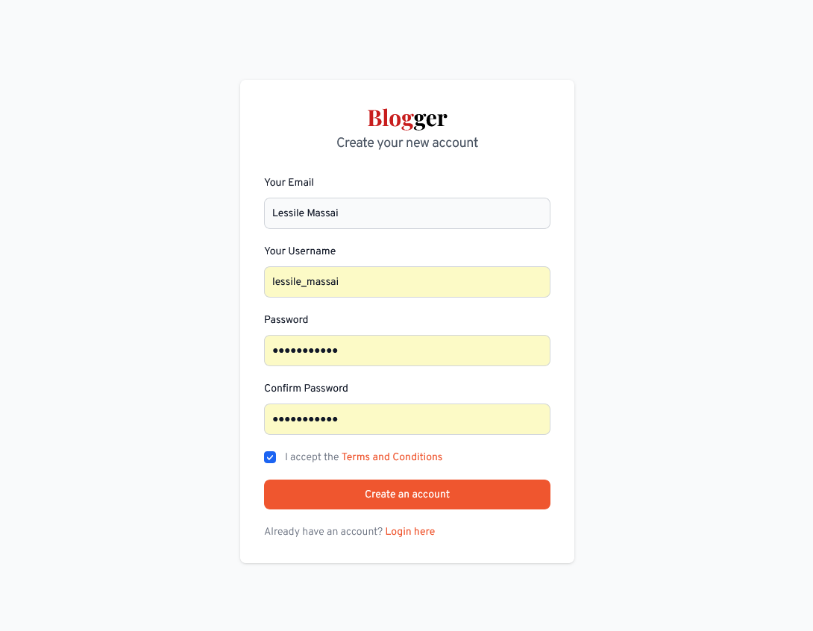
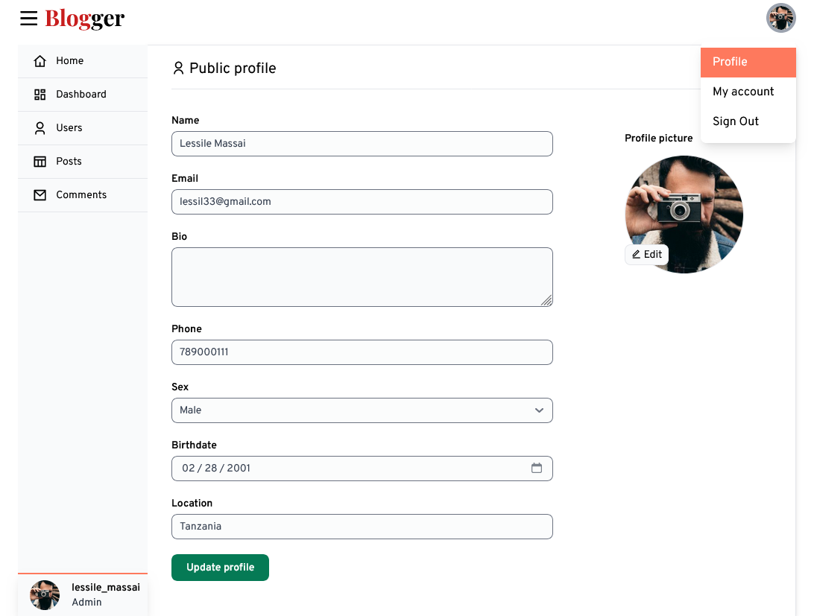
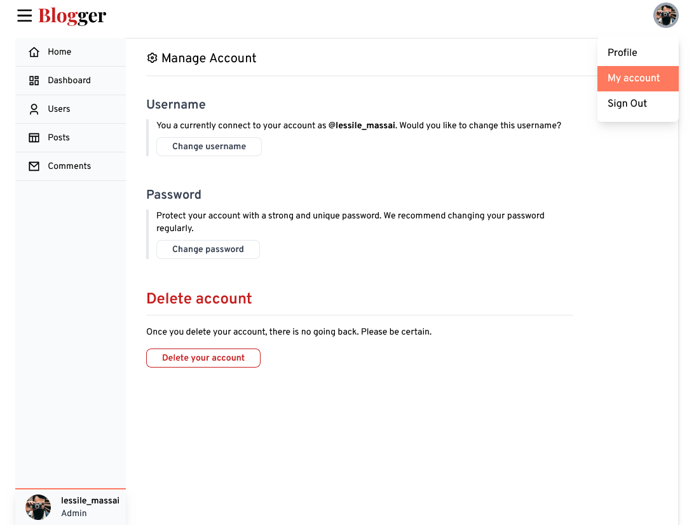
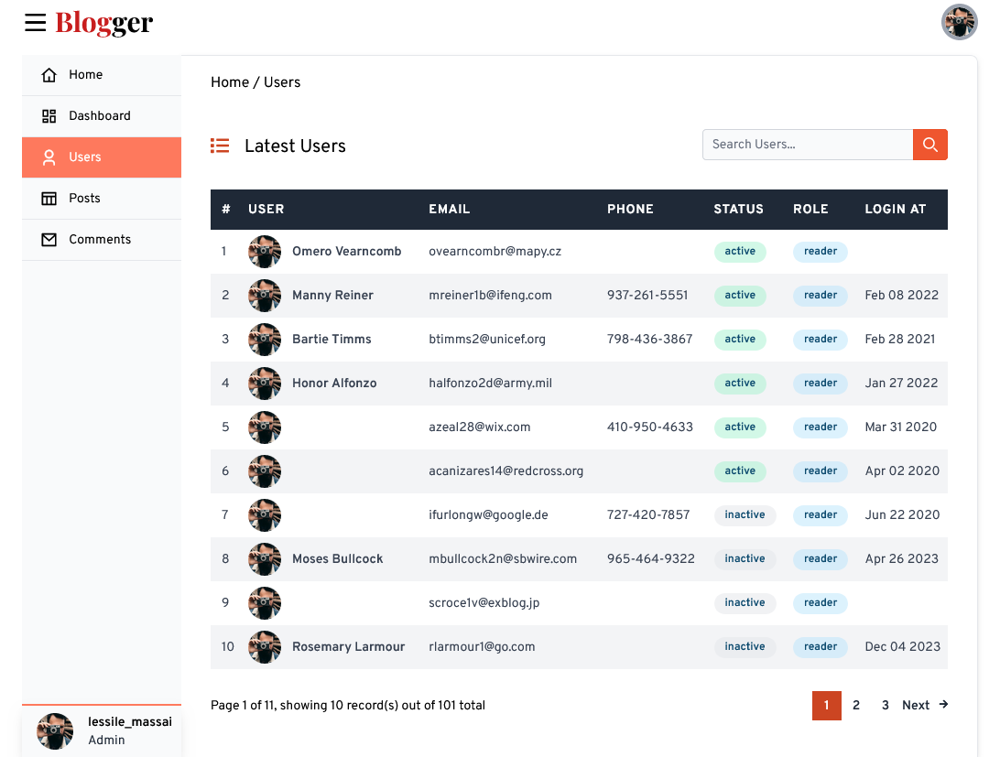

# Blog Client Application Admin Panel

A fully-functional blogging website having an admin panel and a blog portal powered by SvelteKit

## Content of this file

- [Introduction](#introduction)
- [Set up the project](#set-up-the-project)
- [Working Model](#working-model)

**Prerequisites**

To run this project in your local machine, you will need a [Blog Backend Restful API](https://github.com/theomaro/blog-restful-api) made for this project. Just follow the installation guide and you are good to go.

## Introduction

I developed a fully-functional blogging website having an admin panel and a blog portal.

- Admin panel controls all the activities in the portal.
- It can be used to approve users, add new admins, add new posts, and moderate comments.

Technologies used

- **Frontend**: SvelteKit, Tailwind CSS and TypeScript.

- **Backend**: Node JS, Express JS and MySQL

## Set up the project

- Install packages

```npm
npm install
```

- Set development enviroment variables

```
$ touch .env && echo PUBLIC_API_URL=http://localhost:3000/api
```

- Run development server

```npm
npm run dev
```

## System Requirements

### Admin Portal Features

- Admin will be able to login to an admin account
  - Admin and only admin can access the admin panel
- Admin will be able to update admin profile, username or password
- Admin will be able to delete admin account
- Admin will be able to see all other users of the system
- Admin will be able to register a new user to a system
- Admin will be able to update existing user profile
- Admin will be able to delete existing user profile
- Admin will be able to activate, deactivate or ban other users
- Admin and only admin will be able to assign roles to other users
- Admin will be able to search users in a system

## Working Model

- **Selected Snapshots of Admin Portal:**

| Feature             | Preview                                           | Preview                                               |
| ------------------- | ------------------------------------------------- | ----------------------------------------------------- |
| User Authentication |  /Login                      |  /Register                 |
| User Account        |  /account/profile |  /account/settings |
| Dashboard           |  /users/all                       |
